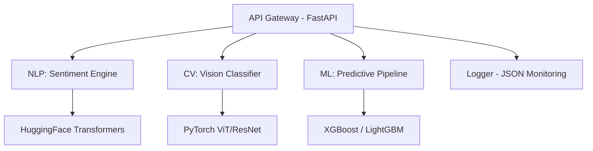

# Aether-Advanced-Intelligence-Suite 🚀

[](https://github.com/FatmaBENMBAREK435/Aether-Advanced-Intelligence-Suite)
[](https://opensource.org/licenses/MIT)
[](https://github.com/FatmaBENMBAREK435/Aether-Advanced-Intelligence-Suite/graphs/commit-activity)

A professional-grade multimodal AI suite integrating state-of-the-art Natural Language Processing (NLP), Computer Vision (CV), and Predictive Machine Learning pipelines into a unified API gateway.

## 🏗️ Architecture



## 🛠 Modules

### 🔹 NLP Sentiment Engine
Advanced transformer-based implementation using HuggingFace's `AutoModel` for sentiment and emotion analysis. Optimized for high-throughput inference with batch processing support.

### 🔹 CV Vision Classifier
Deep Learning implementation utilizing Vision Transformer (ViT) or ResNet architectures in PyTorch. Provides high-accuracy image classification and feature extraction capabilities.

### 🔹 ML Predictive Pipeline
Automated end-to-end Machine Learning pipeline for tabular datasets. Includes:
- Robust feature engineering and preprocessing.
- Hyperparameter optimization for XGBoost/LightGBM.
- Model serialization and versioning.

### 🔹 API Gateway
Unified entry point built with FastAPI, featuring asynchronous processing, request validation (Pydantic), and standardized JSON response structures.

## 🚀 Getting Started

### Prerequisites
- Python 3.9+
- Docker & Docker Compose

### Installation
```bash
git clone https://github.com/FatmaBENMBAREK435/Aether-Advanced-Intelligence-Suite.git
cd Aether-Advanced-Intelligence-Suite
pip install -r requirements.txt
```

### Run with Docker
```bash
docker build -t aether-suite -f docker/Dockerfile .
docker run -p 8000:8000 aether-suite
```

## 📊 Monitoring
All logs are emitted in standardized JSON format to ensure compatibility with modern observability stacks (ELK, Prometheus/Grafana).

## 📄 License
This project is licensed under the MIT License - see the [LICENSE](LICENSE) file for details.
